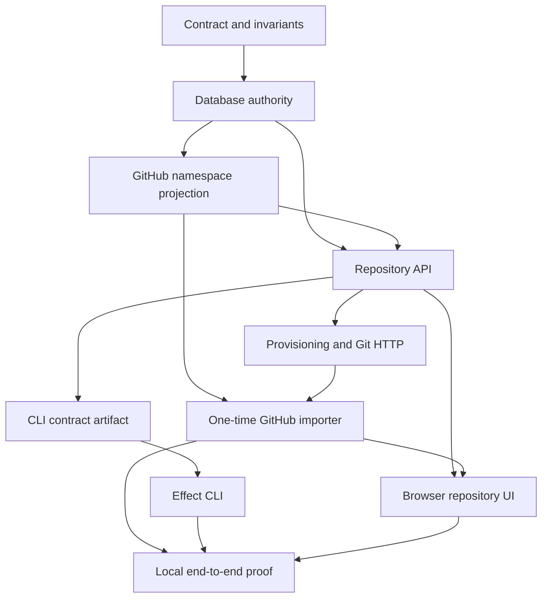

# Repository creation and CLI implementation roadmap

Date: 2026-08-20

Status: Implementation complete; local end-to-end and staging verification
remain

## Outcome

Implement repository creation, one-time GitHub import, Git smart HTTP, browser
management, and the `@openagentsinc/cli` package as one tested product across
the `openagents.com` Phoenix repository and the `openagents` Effect monorepo.

The product specification remains the contract:
[Repository creation, GitHub import, and OpenAgents CLI specification](repository-creation-and-openagents-cli-spec.md).
This roadmap records implementation order, owning files, dependencies, tests,
and release evidence. Update the status ledger as each work packet lands.

## Recorded decisions

- Publish the npm package as `@openagentsinc/cli`.
- Expose the `openagents` binary. Do not ship an `oa` alias in the first
  release.
- Use Effect TypeScript and the monorepo-pinned Effect 4 release.
- Use `effect/unstable/cli` for argument and flag parsing.
- Default to the `production` profile at `https://openagents.com`.
- Provide the `staging` profile at `https://staging.openagents.com`.
- Provide the `local` profile at `http://localhost:4000`.
- Support `--api-url`, `OPENAGENTS_API_URL`, `--profile`, and
  `OPENAGENTS_PROFILE` for explicit endpoint selection.
- Scope stored credentials to the normalized API origin.
- Pin automated and local end-to-end tests to `http://localhost:4000` and fail
  closed if a test resolves a production or staging origin.
- Use GitHub numeric user and organization IDs as namespace identity. Use the
  current GitHub login as a mutable display and route projection.
- Request `read:org` in addition to the existing `repo` grant so OpenAgents can
  project organization membership and roles.
- Import one accepted GitHub ref snapshot. Do not install a webhook or schedule
  later synchronization.
- Use `/{owner}/{repo}` for the repository home after executable reserved-route
  tests prove that product routes cannot become namespaces.
- Start distribution through npm. Gate standalone artifacts and an installer as
  a later release packet.

## Definition of done

All of these statements require direct evidence before this roadmap can move to
`Complete`:

- A GitHub-authenticated user receives a user namespace keyed by the same
  numeric GitHub user ID.
- An eligible GitHub organization appears as a namespace keyed by the same
  numeric GitHub organization ID and current login.
- The browser and CLI create private or public repositories through the same
  Phoenix context operation.
- The browser and CLI import an authorized GitHub repository once, including
  its accepted branches, tags, and reachable Git objects.
- A later GitHub update does not change the imported OpenAgents repository.
- The repository API returns stable JSON and error envelopes from a versioned
  Phoenix-owned contract artifact.
- Public repositories support anonymous clone and fetch.
- Private repositories remain hidden from unrelated users.
- Repository members with write roles can push. Read-only and unrelated users
  cannot push.
- Git storage uses a stable repository UUID and survives deletion of the local
  bare cache through WAL reconstruction.
- `@openagentsinc/cli` targets production by default and can explicitly target
  staging, local, or a validated custom HTTPS API origin.
- CLI credentials, GitHub credentials, device codes, and clone URLs never
  appear in command arguments, logs, JSON output, repository configuration, or
  durable import records.
- `mix precommit` passes in `openagents.com`.
- `pnpm run check` passes in `openagents`.
- A disposable local test at `http://localhost:4000` proves create, push,
  clone, exact commit SHA, import, exact refs, and no later synchronization.

## Implementation dependency graph

The schema, migrations, route table, generated contract artifact, package
manifest, lockfile, and behavior-contract registry are shared integration
points. Change them serially under one integration owner.

## Work packet 0: Record the contract and safety boundaries

**Owner:** `openagents.com`, with a matching invariant and behavior-contract
update in `openagents` when the CLI package begins.

1. Update `docs/repository-creation-and-openagents-cli-spec.md` with the package
   name and endpoint profiles.
2. Add this roadmap and keep its status ledger current.
3. Add repository lifecycle, namespace, import snapshot, and credential
   boundaries to `openagents.com/INVARIANTS.md` before server activation.
4. Add a pending then enforced CLI behavior contract in the monorepo for the
   user requirement that the CLI targets production by default and supports
   local, staging, and custom API origins.
5. Record the `@openagentsinc/cli` claim and worktree in the accepted work
   packet before monorepo mutation.

**Evidence:** Documentation checks, invariant tests, behavior-contract tests,
and a clean diff review that finds no production claim ahead of implementation.

## Work packet 1: Add namespace and repository lifecycle persistence

**Owner:** `openagents.com`.

Generate migrations with `mix ecto.gen.migration`. Do not hand-author migration
timestamps.

1. Add `namespaces` with provider identity, current slug, namespace kind,
   refresh time, state, and optional local user owner.
2. Add `namespace_aliases` for previous GitHub logins. Allow aliases to resolve
   routes, but never use them as mutation authority.
3. Backfill a namespace for `OpenAgentsInc/openagents.com` using an operator-
   supplied or migration-safe GitHub organization ID. Refuse deployment if the
   required production identity is absent or inconsistent.
4. Add `namespace_id`, `description`, `lifecycle_state`, `provisioning_kind`,
   `provision_error_code`, `storage_key`, `created_by_user_id`, and `ready_at`
   to `repositories`.
5. Replace path uniqueness with `{namespace_id, name_key}` while retaining a
   bounded compatibility projection for `owner` during the migration.
6. Add `repository_imports` with immutable source IDs, bounded source
   projections, accepted ref digest, head SHA, state, attempts, error code, and
   timing.
7. Add `repository_provisioning_outbox` with operation kind, repository ID,
   import ID, idempotency identity, attempt state, retry time, and bounded
   failure code.
8. Add a request-idempotency table keyed by principal, operation, key, and
   normalized request digest.
9. Add Ecto schemas under `lib/openagents/repositories/` and associations on
   `Repository`.
10. Rework `OpenAgents.Repositories` around transactionally created repository,
    owner membership, optional import, idempotency receipt, and outbox rows.

**Tests:** `test/openagents/repositories_test.exs`, migration lineage tests,
constraint tests, rename/alias tests, collision tests, atomic rollback tests,
and migration up/down rehearsal against populated fixtures.

## Work packet 2: Project GitHub namespaces and import sources

**Owner:** `openagents.com`.

1. Extend `OpenAgents.GitHub` with bounded Req adapters for:
   - the authenticated user,
   - active organization memberships,
   - one repository by `owner/name`,
   - paginated repositories available to the user,
   - repository permissions,
   - branch and tag refs,
   - Git LFS detection inputs.
2. Decode provider responses into internal structs. Do not pass raw provider
   maps into contexts or LiveViews.
3. Add a namespace projection service that upserts the user namespace at GitHub
   sign-in and refreshes organization namespaces before organization writes.
4. Treat GitHub numeric IDs as authority and logins as mutable projections.
5. Require an active organization membership and the first-release `admin`
   create policy before an organization destination mutation.
6. Require source read access for import. Do not require source-repository admin
   access merely to make a one-time copy.
7. Add `read:org` to the OAuth request and exact granted-scope validation.
8. Make existing connected users reconnect when their retained grant lacks a
   required scope. Do not rewrite stored scope metadata.
9. Return stable failures such as `github_connection_required`,
   `github_scope_required`, `namespace_not_allowed`, and
   `source_repository_not_accessible`.

**Tests:** Req fakes for pagination, public and private repositories, renamed
logins, private organization membership, stale membership, missing scope,
provider failure, rate limiting, malformed JSON, and token redaction.

## Work packet 3: Implement the repository REST API

**Owner:** `openagents.com`.

Add thin controllers and keep policy in `OpenAgents.Repositories` services.

1. Add authenticated routes:
   - `POST /api/v3/user/repos`
   - `POST /api/v3/orgs/{org}/repos`
   - `POST /api/v3/user/repos/imports`
   - `POST /api/v3/orgs/{org}/repos/imports`
   - `GET /api/v3/user/repos`
   - `GET /api/v3/repository-imports/{id}`
2. Add optional-auth `GET /api/v3/repos/{owner}/{repo}`.
3. Add an optional bearer-token pipeline that permits anonymous public reads
   but authenticates a supplied PAT before private reads.
4. Add explicit route-authority entries for authenticated `GET` routes because
   the current classifier treats `/api/v3` reads as public.
5. Enforce `forge:write`, user status, namespace authority, visibility,
   lifecycle state, quotas, names, branches, and idempotency before persistence.
6. Return `201 Created` when bounded provisioning finishes and `202 Accepted`
   when durable work continues.
7. Return stable error envelopes and conceal private repositories with `404`.
8. Add opaque cursor pagination with a maximum page size of 100.
9. Build JSON projections in `RepositoryJSON` and `RepositoryImportJSON`; do not
   assemble public JSON in context modules.
10. Add a versioned repository API artifact under `priv/api-contracts/` and an
    authenticated-independent route or build task that exposes its exact bytes.

**Tests:** New controller tests for status, shape, policy, private concealment,
pagination, idempotency, conflict, organization refresh, imported source
validation, `201`/`202`, and every stable error code. Extend
`test/openagents_web/route_authority_test.exs`.

## Work packet 4: Make repository provisioning durable

**Owner:** `openagents.com`.

1. Add an OTP provisioner under `OpenAgents.Repositories.Provisioner` and start
   it through the application supervision tree with `start_supervised!/1` in
   tests.
2. Claim outbox rows with database locking, bounded attempts, and retry times.
3. Create an empty WAL index using `repository.storage_key` before declaring a
   repository ready.
4. Change `OpenAgents.Forge.Repos`, `WAL`, `Sync`, `Pushes`, `Browse`, and Git
   HTTP resolution to use stable repository storage keys instead of the
   process-wide repository-name allowlist.
5. Keep the deployable repository allowlist separate. Creating a repository
   must never make it buildable or deployable.
6. Make each provisioning transition idempotent and crash-recoverable.
7. Bound and redact operational errors before persistence or response.
8. Add a recovery scan for stranded `provisioning` and retryable `failed`
   records.

**Tests:** Crash after each transition, duplicate outbox delivery, CAS conflict,
cache deletion and reconstruction, two same-named repositories in different
namespaces, storage-key path containment, and proof that repository creation
does not change deployment targets.

## Work packet 5: Implement one-time GitHub import

**Owner:** `openagents.com`.

1. Resolve and persist the immutable GitHub source repository and owner IDs,
   default branch, permissions, branch and tag map, ref digest, and default head
   before the database transaction.
2. Fetch the accepted refs into a unique temporary bare repository.
3. Supply the retained GitHub token through a server-owned Git credential
   callback or askpass boundary. Never place it in a URL, argv, environment
   dump, Git config, log, or import record.
4. Verify that the fetched refs match the accepted digest. Fail with a stable
   source-change code if the snapshot cannot be reproduced.
5. Convert the imported objects and refs into the destination WAL and
   materialize the destination cache.
6. Set the symbolic default branch, accepted head SHA, import completion time,
   and repository readiness atomically at the final database transition.
7. Remove temporary workspaces after success, expected failure, interruption,
   or recovery cleanup.
8. Detect LFS pointer use and return the required pointer-only warning.
9. Install no webhook and schedule no later provider read or write.

**Tests:** Public and private source fixtures, multiple branches and annotated
tags, empty source, submodule pointers, LFS pointers, source changes during
acceptance, interruption, retry, cleanup, exact ref digest, later source update,
and assertions that neither side receives a synchronization call.

## Work packet 6: Authorize Git smart HTTP by repository

**Owner:** `openagents.com`.

1. Change the Git route to `/git/{owner}/{repo}.git` while keeping the temporary
   `/git/openagents.com.git` compatibility route required by the forge cutover
   contract.
2. Allow anonymous upload-pack only for a ready public repository.
3. Accept `oa_pat_...` through HTTP Basic password input for authenticated Git
   operations and resolve it to a user principal.
4. Check repository membership and role before private upload-pack or any
   receive-pack operation.
5. Preserve paired-machine and operator credentials only for their documented
   operational lanes. Do not let them bypass repository resolution.
6. Return indistinguishable `404` responses for private or missing repository
   reads where concealment applies.
7. Keep request bodies bounded, argv-only Git invocation, WAL persistence before
   push acknowledgment, and exact rollback on WAL failure.

**Tests:** Anonymous public clone, anonymous private refusal, member private
clone, writer push, viewer refusal, unrelated-user refusal, banned-user refusal,
failed/provisioning repository refusal, compatibility route, protocol v2, and
credential-redaction scans.

## Work packet 7: Add CLI device authorization

**Owner:** `openagents.com` server contract and browser UI.

1. Add digested, expiring device authorization records with one-time claim and
   polling limits.
2. Add public create and poll endpoints for a secret device code.
3. Add an authenticated, CSRF-protected browser approval page.
4. Mint one scoped `oa_pat_...` after approval and return its plaintext exactly
   once.
5. Return stable pending, slow-down, denied, expired, claimed, and approved
   states without enabling enumeration.
6. Add `cache-control: no-store` on every authorization response.

**Tests:** expiry, denial, one-time delivery, polling pace, collision, CSRF,
revoked user, banned user, concurrent claims, token digest storage, and log
redaction.

## Work packet 8: Build the repository browser interface

**Owner:** `openagents.com`.

1. Replace the hard-coded repository card with a scoped repository stream.
2. Add authenticated repository list, empty, pagination, provisioning, failed,
   and ready states.
3. Add `/repositories/new` with GitHub user and eligible organization namespace
   selection, name, description, visibility, and default branch.
4. Add `/repositories/import/github` with a paginated GitHub repository picker,
   destination name, matching namespace, visibility, LFS warning, and explicit
   one-time import copy.
5. Add `/{owner}/{repo}` repository home, clone controls, import receipt, and
   links to code, Issues, and Projects.
6. Put the dynamic repository route after every reserved route and maintain an
   executable reserved-segment inventory.
7. Use `OpenAgentsWeb.UI` primitives, Basecoat imports already required by the
   surface, stable DOM IDs, keyboard operation, and responsive layouts.
8. Keep GitHub tokens and raw Git output outside LiveView assigns.

**Tests:** LiveView forms and outcomes by DOM ID, namespace selection, private
default, import picker pagination, import progress/failure, ready-only clone
instructions, reserved routes, accessibility, and browser smoke coverage.

## Work packet 9: Scaffold `@openagentsinc/cli`

**Owner:** `openagents` monorepo in a fresh worktree from current
`origin/main`.

1. Create `packages/openagents-cli/package.json` with name
   `@openagentsinc/cli`, ESM exports, `openagents` bin, Node 24 engine, build,
   test, typecheck, lint, and package verification scripts.
2. Add `tsconfig.json` using the monorepo TypeScript and Effect language service
   conventions.
3. Add the package to the existing workspace through `packages/*`; do not add a
   second workspace mechanism.
4. Pin `effect`, `@effect/platform-node`, and test dependencies through the root
   catalog. Update the shared lockfile once under the integration owner.
5. Add Effect Schema decoders for the Phoenix-owned contract artifact and pin
   its version and SHA-256 digest.
6. Define services for configuration, credentials, HTTP, authentication,
   repository operations, Git, credential helper, browser launch, and output.
7. Model expected failures with `Schema.TaggedErrorClass` and map exit codes in
   one exhaustive boundary.
8. Add the owner-stated endpoint behavior to the package behavior-contract
   registry and enforce it with tests.

**Tests:** package entrypoint, `--help`, `--version`, invalid input, contract
digest, schema decoding, packaging contents, Node 24 execution, and no
production network access from tests.

## Work packet 10: Implement CLI configuration and authentication

**Owner:** `openagents`.

1. Resolve configuration in this order: command flags, environment variables,
   persisted profile, then production default.
2. Validate and normalize API origins. Permit plain HTTP only on loopback hosts.
3. Keep credentials isolated by normalized origin.
4. Use `Config` and `ConfigProvider` for environment input; do not read
   `process.env` in application services.
5. Implement `auth login`, browser launch, device polling with `Schedule`, token
   stdin, status, logout, and Git helper setup.
6. Use an admitted operating-system credential adapter for attended use. Use
   `OPENAGENTS_TOKEN` without persistence for headless use.
7. Implement the exact Git credential-helper protocol without printing the
   token.
8. Redact authorization headers, tokens, device secrets, filesystem paths, and
   raw response bodies from every output mode.

**Tests:** production, staging, local, custom HTTPS, loopback HTTP, precedence,
origin-scoped credentials, malformed origins, fake browser, fake clock polling,
headless behavior, token stdin, JSON output, signals, and secret tripwires.

## Work packet 11: Implement CLI repository commands

**Owner:** `openagents`.

1. Implement `repo create`, including visibility, description, branch, source
   directory, remote name, idempotency key, `201`/`202`, and polling.
2. Implement `repo import`, including matching namespace, destination name,
   visibility, timeout, source head receipt, and no-sync notice.
3. Implement cursor-based `repo list` and `repo view`.
4. Implement `repo clone` using the server-provided clone URL.
5. Implement safe repository inference from an admitted remote and explicit
   `-R` override.
6. Refuse to overwrite an existing unrelated remote.
7. Execute Git with argv arrays, bounded captured output, cancellation, and no
   credential in the remote URL.
8. Keep human progress on stderr when JSON owns stdout.

**Tests:** all command options, mutual exclusions, error and exit-code mapping,
idempotent retry, timeout without server cancellation, remote inference, remote
collision, Git failure, JSON snapshots, interruption, and token redaction.

## Work packet 12: Verify locally across both repositories

**Owner:** cross-repository integration.

1. Start an isolated Phoenix server at `http://localhost:4000` with local WAL
   storage, a disposable database, deterministic GitHub fakes, and forge
   deployment disabled.
2. Create a fixture GitHub user, organization, retained grant, and source bare
   repository without exposing a token to the test process output.
3. Run the CLI with `OPENAGENTS_API_URL=http://localhost:4000`.
4. Authenticate with a disposable PAT or complete the device flow.
5. Create a repository, configure Git credentials, push a commit, clone it, and
   compare the exact commit SHA.
6. Import a fixture with multiple branches and tags, compare the complete ref
   map, update the source, and prove the destination remains unchanged.
7. Prove anonymous public clone, private concealment, writer push, and viewer
   refusal.
8. Delete the destination bare cache, reconstruct it from WAL, clone again, and
   compare refs.
9. Scan server and CLI logs plus Git config for fixture secrets and credentialed
   URLs.
10. Run `mix precommit` and `pnpm run check` from the exact delivered revisions.

**Evidence:** Store a bounded test receipt with repository revisions, contract
digest, API origin, exact commit and ref digests, test counts, and secret-scan
result. Do not store tokens, local absolute paths, or repository content.

## Work packet 13: Stage and release

**Owner:** release operator after local completion.

1. Deploy the server to `https://staging.openagents.com` through the admitted
   staging gate.
2. Run the CLI with `--profile staging` and repeat create, import, clone, push,
   refusal, recovery, and redaction checks.
3. Confirm migrations, OAuth reconnect copy, GitHub rate behavior, Cloud Storage
   WAL durability, and private repository concealment.
4. Pack `@openagentsinc/cli`, inspect the tarball, install it into an empty
   prefix, and run its command matrix.
5. Publish an npm preview only after the server and CLI contract digests match.
6. Keep standalone binaries, the installer, self-update, pull requests,
   mirroring, deletion, and SSH transport in later gated packets.

## Status ledger

| Packet | State | Evidence |
| --- | --- | --- |
| 0. Contract and safety boundaries | Complete | `INVARIANTS.md`, Phoenix contract artifact, CLI behavior contract |
| 1. Namespace and lifecycle persistence | Complete | Lifecycle migrations and `repository_lifecycle_test.exs` |
| 2. GitHub namespace projection | Complete | GitHub adapter, exact `repo` and `read:org` scopes, projection tests |
| 3. Repository REST API | Complete | Repository controllers, JSON contract, idempotency and pagination tests |
| 4. Durable provisioning | Complete | Provisioning outbox, reclaimable worker, and cache reconstruction tests |
| 5. One-time GitHub import | Complete | Frozen refs, Git bundle WAL entry, cache-loss and no-later-sync tests |
| 6. Repository Git HTTP authorization | Complete | Public reads, PAT writes, role refusal, and legacy-route tests |
| 7. CLI device authorization | Complete | One-time device-code context, API, browser approval, and polling tests |
| 8. Repository browser interface | Complete | List, create, import, empty, failed, private, and code-route LiveView tests |
| 9. CLI package scaffold | Complete | `@openagentsinc/cli`, Effect 4 command graph, build, and package inspection |
| 10. CLI configuration and authentication | Complete | Profiles, custom origins, OS credential store, and Git helper tests |
| 11. CLI repository commands | Complete | Create, import, list, view, clone, source remote, inference, and refusal tests |
| 12. Local cross-repository verification | In progress | Contract digests and focused suites pass; disposable CLI-to-server create, push, clone, and import proof remains |
| 13. Staging and release | Not started | — |

## Completion audit

Before changing this roadmap to `Complete`, inspect current files and command
output for every definition-of-done item. A passing unit test does not prove an
end-to-end behavior unless the test crosses the same browser or CLI, API,
database, GitHub adapter, WAL, and Git boundaries as the requirement. Record
missing or indirect evidence as incomplete and continue implementation.
